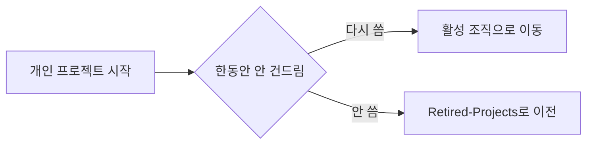
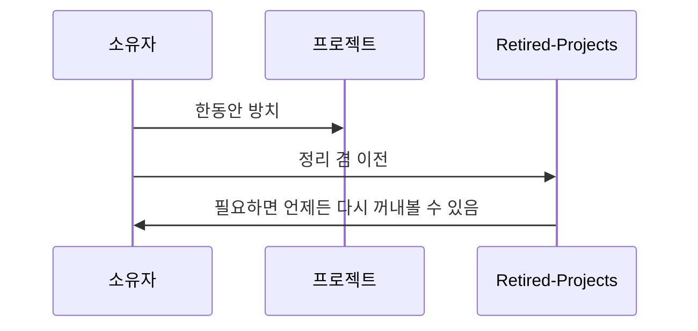

# Retired Projects

더 이상 손대지 않는 프로젝트들을 모아두는 곳입니다. 지우진 않았습니다 — 나중에 다시 볼 수도 있으니까요.

## 여기로 오는 기준

### 보관 흐름

## 대표 사례

- AIHQ / Quorum 계열 — 리브랜딩되어 지금의 Solomon으로 이어짐, 이전 이름의 버전들
- 각종 -legacy, -backup — 스냅샷용으로 남긴 것들
- 잠깐 만들다 만 사이드 프로젝트들
