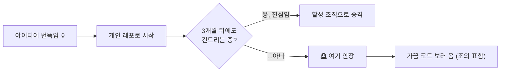
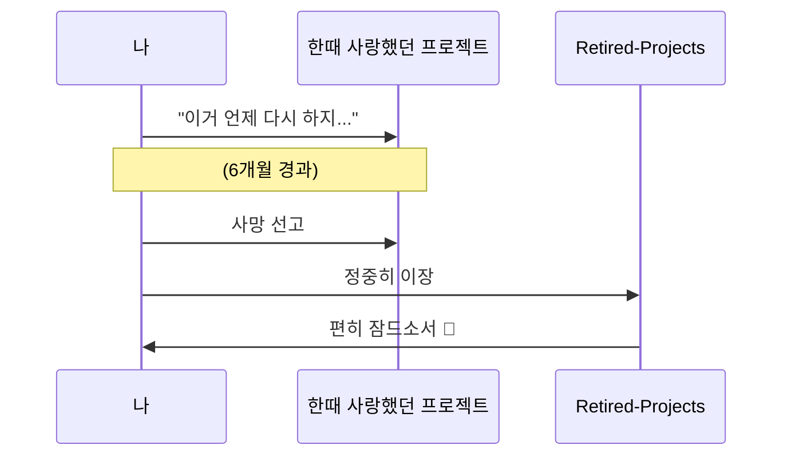

# ⚰️ Retired Projects

> *"여기 잠들다."*

한때는 다 잘될 줄 알았던 프로젝트들의 무덤입니다. 코드는 죽지 않습니다, 그저 org만 옮겨질 뿐.

## 묘지 안내도

### 장례 절차

## 여기 잠든 이유들 (대표 사례)

- **AIHQ / Quorum 계열** — 리브랜딩되어 새 이름(Solomon)으로 환생, 껍데기만 남음
- **각종 -legacy, -backup** — "혹시 몰라서" 남긴 스냅샷들
- **한 번 켜보고 안 켠 사이드 프로젝트들** — 가장 큰 무덤 지분

묘비명을 남기고 싶다면 README에 자유롭게 추가하세요. 아무도 안 볼 확률이 높습니다.
