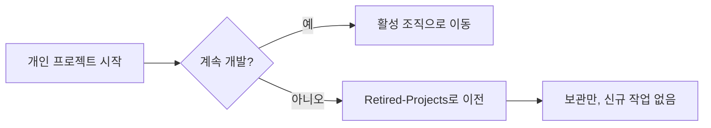
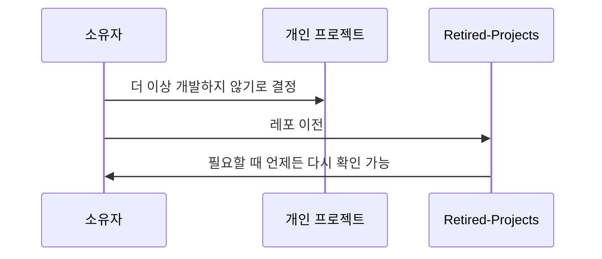

# Retired Projects

더 이상 진행하지 않는 폐기 프로젝트를 모아두는 곳입니다.

## 어떻게 여기로 오나요

```mermaid
flowchart LR
    a[개인 프로젝트 시작] --> b{계속 개발?}
    b -- 예 --> c[활성 조직으로 이동]
    b -- 아니오 --> d[Retired-Projects로 이전]
    d --> e[보관만, 신규 작업 없음]
```

### 이전 흐름

```mermaid
sequenceDiagram
    participant O as 소유자
    participant P as 개인 프로젝트
    participant R as Retired-Projects
    O->>P: 더 이상 개발하지 않기로 결정
    O->>R: 레포 이전
    R->>O: 필요할 때 언제든 다시 확인 가능
```
